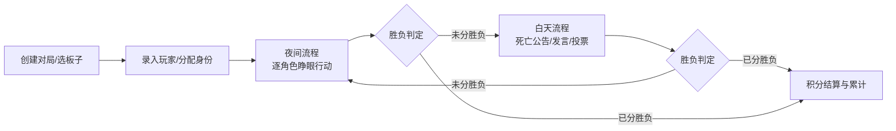
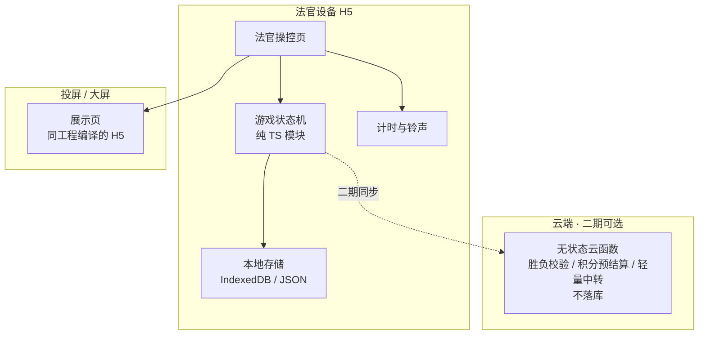

# 狼人杀法官助手 · 设计文档（v0.2）

> 日期：2026-09-24
> 依据规则：`京城大师山东公开赛第二季执行手册.pdf`（37 页，已视觉识别）、`摩卡杯比赛规则.pdf`（2 页）、`规则提取文档.md`（M0 产出，差异项全部确认）
> 状态：**M0 规则提取已关闭，可进入 M1 技术骨架**；唯一遗留：机械狼学得毒药是否无视解药（版型开关，非阻塞）

***

## 1. 项目概述

给狼人杀**法官**使用的工具 APP，用于：

- 配置版型、配置积分规则、配置计时规则
- 执行**夜间 / 白天流程**：按角色逐个引导「请 XX 睁眼 / 闭眼」，执行行动与记录
- **同步计时**：每个环节的倒计时与铃声提醒，起止规则严格对齐手册
- **计算场上情况**：存活/死亡、阵营分布、票型统计
- **计算胜利条件**：每轮结束后自动判定狼人/好人阵营胜负
- **实时统计积分**：按手册规则（基础分 + 胜负分 + 行为分 + 附加分）逐局结算、累计排名，全程可视
- **后续扩展**：微信小程序玩家端（二期）

***

## 2. 已确认的关键决策

| 决策点   | 结论                                                                                       |
| ----- | ---------------------------------------------------------------------------------------- |
| 使用形态  | **分两阶段**：阶段一为法官单设备 + 投屏（H5 大屏）；阶段二为玩家手机/小程序联动                                            |
| 架构与资源 | **本地优先**：所有业务数据存本地（设备），**不上云**；云端仅提供**无状态计算服务**（如胜负判定、积分预结算），服务器资源占用极低（阶段一甚至零服务器、完全离线可用） |
| 规则来源  | **以执行手册为准 + 规则可视化配置**：手册内容为默认值，法官可在配置页调整角色、时长、积分权重                                       |
| 首批范围  | **单局流程工具**（不含赛事管理 / MVP·SVP / 申诉，全部列入二期）                                                 |

***

## 3. 用户与使用场景

- **法官**（唯一操控者）：开一局 → 配板子 → 录玩家 → 发身份 → 跑夜间 → 跑白天 → 结算积分
- **展示对象**：投屏/大屏给全桌玩家看（**只展示场上状态，绝不展示身份**）
- **典型一局流程**：

***

## 4. 核心功能模块（阶段一首批）

### 4.1 规则与板子配置（规则可视化配置）

- 内置角色库（以手册为准，如：预言家、女巫、猎人、守卫、白痴、狼人、石像鬼、诡狼 等，**待手册 OCR 后定稿**）
- 板子 = 角色组成 + 人数 + 特殊规则开关，法官可新建/修改/保存多套板子，提供预设版型
- 每角色的**夜间行动时长**可配置（手册对部分角色有分阶段时长特别规定，见 §7）

### 4.2 对局管理

- 创建对局：选择板子、录入玩家（姓名/花名 + 座位号）、随机或手动分配身份
- 身份查看：**轻触显示 / 长按显示 / 一键全部隐藏**，防误触、防偷看
- 状态机：准备 → 夜间 → 白天 → 结算，支持**暂停 / 回退上一步 / 手动跳转**

### 4.3 夜间流程（核心价值）

- 按板子顺序逐角色引导：显示口令 → 倒计时开始 → 铃声结束
- **计时规则**：行动时长自「XX 请睁眼」口令结束起，至倒计时铃声结束止；口令朗读时间不计入时长
- **分阶段计时**：支持单角色多段计时（如石像鬼「验人 15s + 击杀 15s」、诡狼「确认狼人 10s + 诡计 15s」）
- **行动记录**：每角色行动结果由法官点选录入（验人结果、击杀目标、救/毒/不使用、守卫守人、猎人开枪等），支持修改
- 全程支持**回退**（回退到上一步重新执行）

### 4.4 白天流程

- **死亡公告**：汇总夜间死亡结果，自动生成播报内容
- **发言计时**：默认警长竞选 90s / 放逐 90s / 警长 120s / 遗言 90s，剩余 30s 提示、结束提醒（均可配置，可关闭）
- **投票环节**：记录票型（法官点选「谁投了谁」），戴盔 5 秒示票、自动统计并高亮平票/放逐结果，按规则处理 PK 计票
- 遗言管理、警长竞选（**纳入首批，仅记录投警徽票结果**）

### 4.5 场上状态与胜负判定

- 实时维护：存活/死亡、阵营存活数、身份公开/隐藏
- **自动胜负判定**：每轮夜间/白天结束后，按板子配置的胜利条件（屠边/屠城等）自动判定并弹窗提示
- 判定逻辑独立为纯函数模块，可单元测试

### 4.6 积分统计（实时）

- 积分规则可视化配置：基础分、胜负分、行为分、附加分，每项可设分值/开关
- **每局自动结算**：结算结果当场展示（谁 +多少 + 原因），并可手动微调
- **实时累计**：本场多局/多天累计积分与排名，排行榜即时刷新
- 历史积分本地持久化

### 4.7 数据本地化与历史

- 全部数据存本地：对局历史、积分流水、板子配置
- 支持导出：**JSON** 文件、**结果分享图（长图/卡片）**
- 阶段一**完全离线可用**，云端零依赖

### 4.8 投屏模式

- 大屏/投屏展示页（**横屏**）：当前阶段、倒计时大字、行动进度、**存活图、票型统计**（不展示积分榜）
- 投屏页**永不显示身份信息**；身份页仅法官设备可见

### 4.9 二期功能（不在首批）

- 微信小程序玩家端：私密身份查看、睁眼确认、玩家投票、MVP/SVP 票选
- 多端实时同步（方案待定，见 §8 之 11）
- 赛事管理（战队、赛段、上场次数限制）、人气值、申诉判罚

***

## 5. 技术架构与数据方案

### 5.1 总体架构（本地优先 + 无状态云端计算）

- **前端框架：Taro 4（React + TypeScript）**，一套代码编译 H5（阶段一：手机操控页 + 投屏页）和微信小程序（阶段二）
- **本地存储**：H5 用 IndexedDB / localStorage；小程序用 Storage + 本地文件（二期）
- **核心逻辑**：游戏状态机、胜负判定、积分计算全部写成**纯 TS 模块**（无 UI 依赖），便于单测与多端复用
- **计时**：本地定时器 + 铃声；多端同步（二期）以服务端/主机时间戳为基准校准
- **云端（二期可选）**：微信云开发云函数（按量计费、无固定服务器），仅做无状态计算与轻量转发，**不存储业务数据**；满足「低服务器资源、数据不上云、云只计算」
- **为什么满足低资源诉求**：阶段一零服务器、完全离线；阶段二云端仅按需调用无状态函数，无常驻服务、无数据库

### 5.2 数据模型（草案）

| 实体               | 关键字段                         |
| ---------------- | ---------------------------- |
| Role 角色          | id、名称、阵营、夜间行动类型、默认时长、分阶段时长列表 |
| BoardConfig 板子   | id、名称、角色组成、胜利条件、开关项          |
| Game 对局          | id、板子、时间、状态、胜负结果、备注          |
| Player 玩家        | id、姓名/花名、座位号、身份、存活状态         |
| NightRecord 夜间记录 | 对局、角色、行动类型、目标、结果、时段          |
| VoteRecord 投票记录  | 对局、投票者、被投票者                  |
| ScoreRule 积分规则   | 类型、分值、启用开关、说明                |
| ScoreRecord 积分流水 | 对局、玩家、项目、分值、原因、时间            |

***

## 6. 积分与规则摘要（详见《规则提取文档.md》）

M0 已完成两份规则文件提取，完整规则见 [规则提取文档.md](file:///e:/狼人杀/规则提取文档.md)，要点：

1. **版型库（共 13 个，全部首批内置）**：手册 9 个 12 人版型（预女猎白、狼王守卫、梦魇摄梦、血月猎魔人、纯白夜影、石像鬼守墓人、狼王摄梦人、梦魇守卫、等式悖论）+ 机械狼通灵师（12 人）+ 摩卡杯 3 个 15 人版型（狼王守卫 15 人、狼美猎骑、机械狼）
2. **发言时长（已确认默认值，可配置）**：警长竞选 90s、放逐 90s、警长 120s、遗言 90s；剩余 30s 提示，结束提醒
3. **夜间时长（手册默认，可配置）**：狼人首夜 90s（剩 30s 提示「请迅猛」）/次夜 45s（剩 15s）；发动技能 15s；确认状态 5s；确认身份首夜 5s 次夜不唤醒；石像鬼、诡狼支持分阶段计时
4. **积分构成**：胜负分（胜 +5/负 0）+ 行为分（13 个角色逐项，含上限与豁免条件）+ 投票分（投狼 +0.5 上限 +1、投好人/弃票 −0.5，含 4 条 PK 计票规则）+ 特殊分（点狼点神、拍刀、连刀、好人零失误、狼拿警徽）+ MVP/SVP/背锅（+2/+1.5/−1）− 违规扣分
5. **行为分冲突结算**：同阵营冲突（同狩同毒）以实际死亡原因为准；不同阵营冲突（同刀同毒）以技能发动过程为准；好人失误情形不计好人分
6. **胜负判定（屠边）**：狼全出且神民均存活→好人胜；同夜双方同时达成→狼人胜；神或民任一全灭且狼存活→狼人胜；白天开场狼队最高票≥其他身份最高票→狼人胜
7. **出局结算顺序**：技能结算（连锁优先处理）→ 遗言 → 警徽移交
8. 赛事管理（赛段/晋级/上场限制/申诉/奖项）→ 二期

***

## 7. 确认清单（✅ 已确认）

> 以下答复已并入需求；剩余待补充项为「机械狼通灵师」版型细节及规则差异项，见《规则提取文档.md》§8。

确认结论汇总：

| # | 事项 | 结论 |
| --- | --- | --- |
| 1 | 板子与角色集 | 首批：12 人「预女猎白」「狼王守卫」「机械狼通灵师」（规则待补充）+ 手册 9 版型；夜间行动采用**法官逐项点选**录入 |
| 2 | 夜间行动录入 | 法官逐项点选（结构化记录目标+行动类型，作为行为分计算输入） |
| 3 | 白天发言计时 | 需要。默认：警长竞选 90s / 放逐 90s / 警长 120s / 遗言 90s；剩余 30s 提示、结束提醒；均可配置 |
| 4 | 警长竞选 | 纳入首批；竞选环节**只记录投警徽票结果** |
| 5 | 积分细则 | 已从两份规则文件提取定稿，随版型载入角色行为得分集；提供积分规则配置页可调 |
| 6 | 玩家名单 | 默认座位号 1–12（15 人局 1–15），每座可配玩家姓名也可留空；赛前准备环节配置，游戏中可调整 |
| 7 | 历史导出 | 导出 **JSON**；需要**结果分享图（长图/卡片）** |
| 8 | 语音播报 | 需要，默认音色/语速。**无需自行找资源**：H5 端用浏览器内置 Web Speech API（系统中文普通话语音，免费、离线可用）；小程序二期再评估微信同传插件或录音包 |
| 9 | 投屏页 | **横屏**；展示倒计时、存活图、票型（不展示积分榜，身份信息硬性隔离） |
| 10 | 手册 OCR | 由我完成，两份文件均已识别整理（见《规则提取文档.md》） |
| 11 | 二期同步方案 | 待二期前定（局域网直连 / 无状态云端中转），不阻塞一期 |
| 12 | 部署形态 | 手机竖屏操控 + 平板/电脑横屏投屏 |

以下为原始确认记录：

1. **板子与角色集**：首批内置哪些板子/角色？（建议从手册 12 人板起步，含石像鬼/诡狼是否首批？）角色行动输入方式是否按「点选目标」设计？
2. 答：12人局预女猎白、狼王守卫、机械狼通灵师，以及手册中的版型
3. **夜间行动录入**：夜间行动结果希望「法官逐项点选」（更规范、可算行为分）还是「仅记文本备注」（更快）？
4. 答：「法官逐项点选」
5. **白天发言计时**：每名玩家限时发言是否需要？默认时长？（如 3 分钟）
6. 答：警长竞选发言：90秒、放逐发言：90秒、警长发言：120秒、遗言：90秒（这是默认设置，可以在发言时长配置中更改），发言计时剩余x秒时提示玩家（x默认30秒，可以设置）,发言时间结束时提醒玩家
7. **警长竞选**：是否纳入首批？警徽流/警长流程复杂度较高。
8. 答：纳入。警长竞选环节，只记录投警徽票结果。
9. **积分细则**：基础分 / 胜负分 / 行为分 / 附加分各自的分值与规则——待手册 OCR 后逐条给出并请你确认。
10. 答：待手册 OCR 后定稿，然后生成对应的积分规则配置页面，可以进行调整。每个角色的行为得分，调用版型时载入。
11. **玩家名单**：手动录入座位表即可？是否需要花名/图片头像？
12. 答：默认1-12座位号（若15人局为1-15），可以配置每个座位的玩家姓名，也可以不配置。在每一次开始比赛准备环节进行配置，也可以在游戏过程中进行调整。
13. **历史导出**：导出格式偏好（JSON / Excel / 两者）？是否需要结果分享图（长图/卡片）？
14. 答：JSON，需要结果分享图（长图/卡片）。
15. **语音播报**：是否要 TTS 语音朗读口令（如「请狼人睁眼」）？用什么音色/语速？
16. 答：是，用默认音色/语速。有默认资源使用吗，或者还需要我去网络上找资源
17. **投屏页内容**：大屏上展示哪些信息（倒计时/存活图/票型/积分榜）？横屏还是竖屏？
18. 答：横屏，记录倒计时、存活图、票型
19. **手册 OCR**：现在就做手册全文提取（由我做，扫描件识别，关键规则我会再请你校对）？还是你直接提供规则文本/已有的规则表？
20. 答：你来进行OCR，另外也可以参考 摩卡杯比赛规则.pdf
21. **二期同步方案倾向**（仅记录，不阻塞一期）：多端同步倾向「局域网直连（法官设备做主机，零云端）」还是「无状态云端中转（勉强用到云端，不落库）」？
22. **部署形态**：阶段一 H5 在「手机竖屏操控 + 平板/电脑投屏」上运行是否 OK？
23. 答：是，手机竖屏操控 + 平板/电脑投屏上运行
***

## 8. 项目规划与里程碑

| 里程碑             | 内容                                      | 交付物            | 依赖            |
| --------------- | --------------------------------------- | -------------- | ------------- |
| **M0 规则提取**     | OCR 手册全文 → 整理规则清单（角色/时长/积分/行为分）→ 与你逐条确认 | 规则 JSON + 确认记录 | 确认清单 1/2/5/10 |
| **M1 技术骨架**     | Taro H5 工程、核心状态机（纯 TS）、本地存储层、基础 UI 框架   | 可运行骨架 + 单测     | 无             |
| **M2 流程 MVP**   | 对局管理、身份分配、夜间流程（引导/分阶段计时/行动记录/回退）        | 夜间核心流程可用       | M1、确认 1/2/3   |
| **M3 白天+胜负+积分** | 白天流程（死亡公告/发言/投票）、胜负判定、积分结算与累计           | 完整一局可打完并出分     | M2、确认 4/5     |
| **M4 打磨**       | 投屏模式、规则可视化配置、语音播报、历史导出                  | 可实际开赛使用        | M3、确认 6-9     |
| **M5 二期**       | 微信小程序玩家端、多端同步、MVP/SVP/人气值（可选赛事管理）       | 小程序上线          | 确认 11、商务决策    |

执行顺序：M0 → M1 → M2 → M3 → M4（第一批交付）；M5 为第二阶段。

***

## 9. 待办事项（TODO）

### 待你确认（阻塞项）

- [x] 确认清单 §7 全部条目（已答复，见 §7 汇总表）
- [x] 确定手册 OCR 执行方式（由我用视觉模型识别，两份文件均完成）
- [x] 补充「机械狼通灵师」版型规则（12 人：通灵师/女巫/守卫/猎人/4 民/3 狼/机械狼，机械狼六种学习分支已明确）
- [x] 确认首批版型范围（13 个版型全内置）与夜间时长（手册值出厂）/积分差异项（跟随版型包）
- [ ] 仅剩 1 个非阻塞配置项：机械狼学得毒药是否无视解药（做成开关，默认普通毒药，开赛前定即可）

### M0 规则提取（✅ 已完成）

- [x] OCR 提取《执行手册》37 页全文（216 DPI 渲染 + 视觉识别，正文 29 页全部识别）
- [x] 提取《摩卡杯比赛规则》2 页（PDF 自带文本）
- [x] 整理角色库（名称/阵营/行动类型/默认时长/分阶段时长）
- [x] 整理版型库（10 个 12 人版型 + 3 个 15 人版型）
- [x] 整理积分细则（胜负分/行为分/投票分/特殊分/MVP·SVP·背锅/违规扣分）
- [x] 整理行为分冲突结算规则（同刀同毒/同狩同毒/梦游吃毒/毒杀猎魔人等）
- [x] 输出《规则提取文档.md》并完成全部差异项确认
- [ ] 下一步（M1）：将规则落为初始规则 JSON/TS 配置，编码进工程

### M1 技术骨架

- [ ] 初始化 Taro 4 + TypeScript 工程（H5 编译目标）
- [ ] 实现核心游戏状态机（纯 TS：阶段流转/暂停/回退/跳转）+ 单元测试
- [ ] 实现胜负判定纯函数 + 单元测试
- [ ] 实现本地存储层（IndexedDB / JSON 文件，含对局、积分、板子）
- [ ] 搭建基础 UI 框架与路由（操控端 / 投屏端两个入口）

### M2 流程 MVP

- [ ] 板子配置页（角色库 + 组成 + 时长配置）
- [ ] 对局创建页（录玩家、座位号、随机/手动分配身份、身份隐藏交互）
- [ ] 夜间流程页（逐角色引导、口令、分阶段倒计时、铃声、行动记录、回退）

### M3 白天 + 胜负 + 积分

- [ ] 白天流程页（死亡公告生成、发言计时、投票录入与统计）
- [ ] 胜负判定接入夜间/白天循环
- [ ] 积分配置页 + 单局结算页 + 累计排行
- [ ] 历史对局与积分流水页面

### M4 打磨

- [ ] 投屏模式页（横屏：倒计时/存活图/票型，身份信息硬性隔离，不展示积分榜）
- [ ] 规则可视化配置完善（全部积分项可调）
- [ ] TTS 语音播报口令（Web Speech API，系统默认音色/语速）
- [ ] 导出 JSON、结果分享图（长图/卡片）

### M5 二期（小程序）

- [ ] 微信小程序工程（同一 Taro 代码库）
- [ ] 玩家端（私密身份、睁眼确认、投票、MVP/SVP 票选）
- [ ] 多端同步方案落地（局域网直连 / 无状态云端中转）
- [ ] （可选）赛事管理、人气值、申诉判罚

***

## 10. 风险与假设

| 风险/假设              | 影响              | 对策                           |
| ------------------ | --------------- | ---------------------------- |
| 手册为扫描件，OCR 识别准确率有限 | 积分/时长等关键规则可能有误  | 关键规则人工校对，以你确认为准（M0 必做）       |
| 行为分冲突结算（同刀同毒等）逻辑复杂 | 判定输入设计难度上升      | 行动记录尽量结构化（点选目标而非文本），判定模块单测覆盖 |
| 本地优先架构与二期多端同步存在张力  | 数据不出本机 + 多端共享冲突 | 二期前定同步方案（§7-11），预留状态机可序列化能力  |
| 身份私密性（法官设备 = 上帝视角） | 误触/偷看泄露身份       | 轻触显示/一键隐藏 + 投屏身份隔离（硬性约束）     |
| 首局体验复杂度            | 法官不熟悉操作节奏       | 预置手册标准板子与默认时长，一键开始           |

